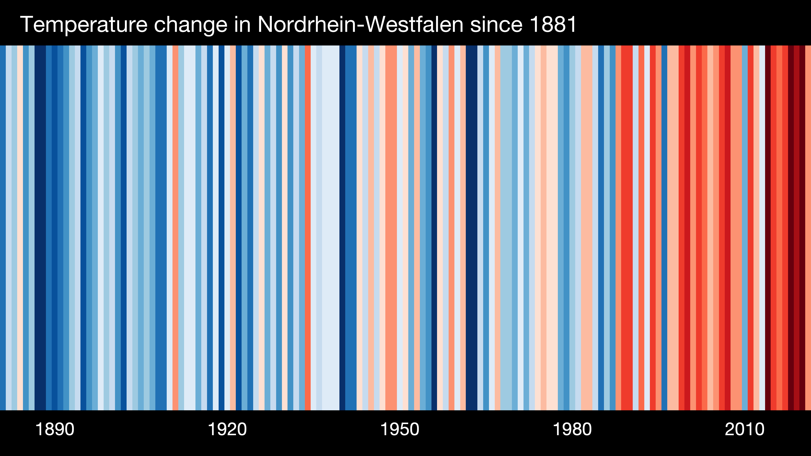
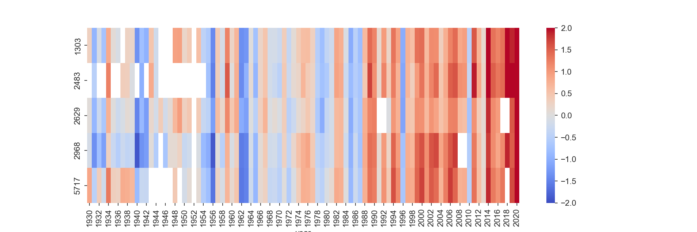
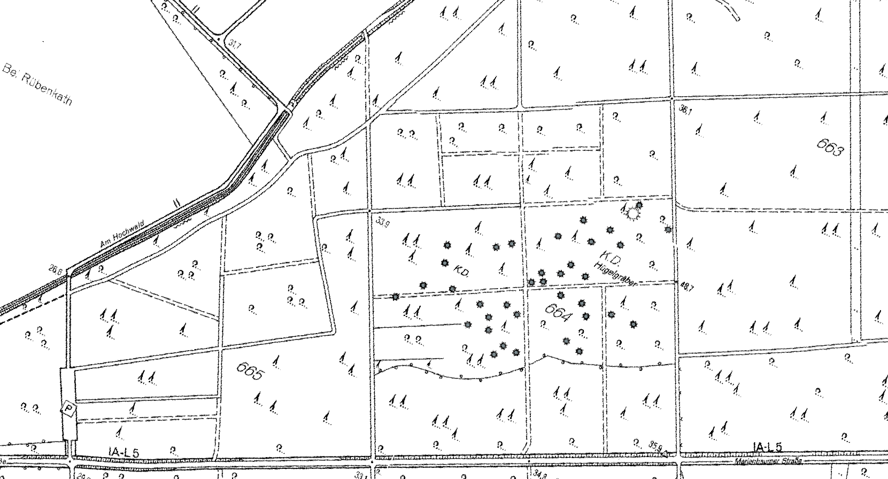

# 9522 Geoinformatics WS2024-2025 -   Final Assignment

## 0. General Remarks
1.This assignment is Only for the students of Geoinformatics. The groups formed by the **Bsc.Geodata Management Systems and Bsc. Geographical Information Systems will have a different assignment**
1. Due date is **Friday 2025-02-28T23:59:59CET**.
1. You can withdraw from exam registration until a week before! 
3. You do not have to write a formal report but you have to sketch the steps you have taken to do the analyses. The code you are uploading as well as additional documentation including a video has to **enable us to redo your work completely!** You must tell us which data you use and where to download it.
4. You can work in **groups of 1 - 3 students**. You have work in the same groups chosen for the assignment in [Moodle course](https://moodle.hochschule-rhein-waal.de/course/view.php?id=18484).
6. Create **one zip file** which contains all your work but **do not add very big data!** 
7. You can use GitHub if you want to. **USE THE FOLLWING REPO NAME:** `Geoinfo_WS2024_2_Final_<Group ID>`, (e.g. Geoinfo_WS2024_2_Final_Group_Z). . 
8. **Upload** your zip file to the **Moodle** upload area. 
10. Use a `README.md` file (and more .md-files, if needed) to describe your work. Upload your Python/Jupyter scripts as well as QGIS projects but **do not add very large datasets** (e.g. no satellite images, excessive DTM tiles in XYZ format, etc.) to your project folder. In case you use very large datasets **share the link to the data** in your documentation and/or your code and describe how to download and store it locally. I would expect local folders like  `<YOUR REPO>/data/...`. 
11. In case you **you produce very large datasets** tell us how and **enable us to reproduce your results** instead of flooding your repo with big data.
13. You have to **produce a presentation** (i.e. Powerpoint or similar) and upload it to your git repo. Describe the **individual tasks**. See the **pptx-template** provided in this assignment repo. The pptx template includes a **self-assessment**. In case you work in groups each member has to provide a self-assessment. 
14. You have to **produce one video per group on your presentation** and add it to the zip you upload. **All students must take part in their group's video presentation**. The video is to present the slides with your results. **Do not explain every detail** in the video, e.g. do not explain how to execute your code line by line, etc. **Just present each task, your methods, and your results**. Refer (name or link) to your code files as well as QGIS projects in your slides such we can reproduce your work if we want.

## 1. Warming Stripes (10 Points)

The British meteorologist Ed Hawkins from the National Centre for Atmospheric Science, University of Reading, came up with the idea to show global warming in terms of colored stripes indicating temperatures above or below a reference temperature with red or blue, respectively. Interactive examples can be studied on the official website [showyourstripes](https://showyourstripes.info/s/europe/germany/nordrheinwestfalen). The development of NRW's mean annual temperature looks like:

 

You have to produce a similar plot but with several stripes in one diagram. Each stripe would represent the development of annual temperatures at a selection of stations. 

**Sub-Task 1.1:**  
Select the stations which are (1) in Bayern, (2) still active and (3) started before 1950. It should be **# stations.** Use **Pandas** to read the station description file [KL_Jahreswerte_Beschreibung_Stationen.txt] (https://opendata.dwd.de/climate_environment/CDC/observations_germany/climate/annual/kl/historical/KL_Jahreswerte_Beschreibung_Stationen.txt) from the historical KL data collection.

Have a look at the available Jupyter notebooks in the geodata git repository and in the [Moodle course](https://moodle.hochschule-rhein-waal.de/course/view.php?id=18484) to get you started.

Modify the notebook according to your needs. 

**Sub-Task 1.2:**  
Use geopandas in your Jupyter notebook to create a geopackage layer with exactly the stations matching the above criteria. Load this into QGIS and use the Bayern WMS service with the topographic map collection as a background map [DTK500](https://geodatenonline.bayern.de/geodatenonline/seiten/wms_uk500). Create a nicely designed and completely annotated map using EPSG:25832. Use the station IDs together with the station names as labels.  

**Sub-Task 1.3:**  
Extend your Jupyter notebook to **automatically download** (using ftplib, wget, or similar) the annual temperature data from the KL data collection, i.e. which automatically downloads the data according to the selected station IDs in the station info dataframe from here: 
https://opendata.dwd.de/climate_environment/CDC/observations_germany/climate/annual/kl/historical/

**Sub-Task 1.4:**  
Use the dataframe with the temperature time series merged columnwise together with seaborn to plot the warming stripes. The diagram with five stations and not including  recent data (2023 missing) looks like:

 

Create a similar plot but for the selected stations including the annual temperature data of 2022. Let the time series run from 1950 to 2022. 

Note that for a station with ID $\mathrm{sno}$, the temperature $\Delta T_\mathrm{sno}(k)$ shown in year $k$ is the negative (blue) or positive (red) deviation from the reference temperature ${\bar{T}}_{\mathrm{sno}}$, which is the mean annual temperature of the station between 1971 and 2000. 

$$
\Delta T_\mathrm{sno}(k) = T_\mathrm{sno}(k) - \bar{T}_\mathrm{sno}
$$

## 2. Improved Warming Stripes and Interpolation (15 Points)
**Sub-Task 2.1:**  
Improve your warming stripes representation by cleaning the dataset. Omit stations which are missing more than 95% of the dates that you are interested in analysing. 

**Sub-Task 2.2:**  
Correct the map of the active stations to display only the resulting stations from task 1.5

**Sub-Task 2.3**  
Your taks is to investigate how well are the data points resulting from interpolation, more specifically Inverse Distance Weights Interpolations (IDW). For this, you should remove the measurements of Station 4104 (Regensburg) from your dataset. Use IDW to interpolate/predict the temperature for the position of this station and compare your interpolated values with the real measurements. Discuss your results.

## 3. Digitization: Burial Mounds in Uedemer Hochwald (10 Points)

 
*Fig.: Burial mounds in Uedemer Hochwald.*

South west of the village Marienbaum (belongs to Xanten municipality) is the forest "Uedemer Hochwald" in which many burial mounds (German: Hügelgrab (sg.), Hügelgräber (pl.)) from our ancestors of the Hallstatt period (a Celtic culture between 850 and 450 BCE) can be found. The above picture shows a map section with some of the burial mounds indicated as grey dots. 
 
**Task 3.1:**   
Georeference the picture of the map above. Start with the QGIS project `gdms0000_Burial_Mounds_Uedem_V001.qgz` in the assignment folder. Georeference the picture of the map by means of the QGIS Georeferencer together with the layer **DTK10**, the NRW topographic map in 1:10000, already imported from the NRW WMS server and added in the QGIS project. Use crossing forest trails, crossroads, road junctions and other features you can identify on DTK10 as land marks (aka ground control points, GCP) with known coordinates (can be read from the QGIS map canvas). Use EPSG:25832. Add the georeferenced map to the QGIS project.
 
**Task 3.2:**   
Create a hillshade model from the DTM layer. Plot your georeferenced map partly transparent on top of the hillshade model. Compare. What do you observe? How good is the georeferenced map section showing the burial mounds? 

**Task 3.3:**   
Use the DTM (not the hillshapde model!) and measure the typical mound heights relative to their direct environment/neighborhood (not the absolute height above sealevel!). What is their typical elvation in the landscape?

**Task 3.4:**   
Study the hillshade model in direction East-North-East of the burial mounds area and search for weakly visible reectangular structures which are not paths. What do you observe? Do you have a guess about the origin of these patterns? Choose at least one of the structures, digitize it with a polygon and save it as a geopackage.

## 4. OpenHygrisC Nitrate Data: Create a Movie with the QGIS Temporal Controller Connected to PostgreSQL / PostGIS (15 Points)

**Spatio-Temporal Data Animation using PostGIS together with QGIS Temporal Controller**

In the last lectures we downloaded and engineered the OpenHygrisC groundwater quality data. We loaded the station info as well as the measurement data into the geodatabase. You can have a look at the two last lecture videos from last year's course starting with `Dr. B.: Geodata - 2023-01-20`. 

The activity of producing movies of groundwater chemistry data was not fully accomplished during the lecture phase but Prof. Becker continued and improved the training material in the scope of the funded project OpenHyPE. You can find his latest software versions [**here**](https://github.com/rolfbecker/OpenHyPE).

Another  source of information is the training material by the master student Sina Navid on the [EOLab Wiki](https://wiki.eolab.de/doku.php?id=eolab:openhype:start). The information a a bit outdated but still quite useful.

**TASK:**
Get the OpenHypE system running. It consists of OpenHygrisC data (station locations, masurement data, catalog of substances) stored in PostgreSQL/PostGIS with QGIS utilizing a live link to the geodatabase. Start with my OpenHyPE git repo. Read the code and execute it. Remember the data base concepts 'views'. They are stored queries (select statements) generally joining and projecting relations. You find some `create view` statements in the Jupyter Notebooks. Furthermore several indexes were created. They are used to improve the performance of data retrieval. They are part of database optimization.

Produce a mpeg (or similar) video with the QGIS Temporal Controller. Don't use the temporal controller slider to move back and forth, instead export the images to produce a video. The video should be of the Nitrate concentration from the earliest available Nitrate measurement (early 1960's) up to the latest measurement.

## 5. SMI Video (20 Points)
The Soil Moisture Index (SMI) is a product from the Drought Monitor of Umweltforschungszentrum Leipzig (UFZ). It classifies the soil moisture in soil moisture index classes (drought classes) according to the long-term local soil moisture distribution. The assignment of a particular soil moisture value to a soil moisture index is not fixed but depends on the history of the local soil moisture distribution over time. Example: A soil moisture of 10% (volumetric) might be classified as very dry at a usually wet location with a higher mean moisture over the last decades but classified as moderate at another location with lower mean moisture.

**Task 5.1:**  
Download the historical Soil Moisture Index data from the topsoil (up to 25 cm depth) and total soil moisture (up to 1.8m) datasets from the official [UFZ Drought Monitor Website](https://www.ufz.de/index.php?en=37937).

**Task 5.2**  
Find a way to import the data in QGIS to use the temporal controller

**Task 5.3**
Genarate a video of the monthly snapshots of the soil moisture index from 2010 to 2018 for the SMI_topsoil and another video for the SMI_totalsoil. Make sure to use an appropiate simbology (you can find an appropiate color scale an explanation of the SMI in the Drought Monitor Website).

## 6. Supervised Land Cover Classification (20 Points)
Land cover classification is the process of identifying and categorizing physical materials on the Earth's surface using data from remote sensing technologies. It involves analyzing the characteristics of the different surface types and grouping them in predefined classes, for example forests, water bodies, soil, agricultural areas and so on. 
For this task you will need the corrected drone image of the survey area from your excursion project. You will also need Orfeo Toolbox (OTB) to perform the classification.

1. Download and install OTB as explained [the following link](https://www.orfeo-toolbox.org/CookBook/Installation.html). **Notice the differences according to your operative system!**

1. Once installed you have to go into QGIS and enable the plugin and make sure to set the paths pointing to **your OTB installation** as described in [this link](https://www.orfeo-toolbox.org/CookBook/QGISInterface.html)

1. If you haven't done that yet. You should download the multispectral orthorectified of the survey area that your group generated and import it in QGIS as a raster layer. 

1. Rearrange the bands such that they are in the order (Green, Red, Red-Edge, Near-Infrared).

1. Currently the rasters contain floating values which will generate a problem with the plugin. So you need to convert these values into integers. For this use the Translate (convert format) from GDAL (you will find it in the processing toolbox).

1. Classify the land cover considering at least the following classes: water body, man-made structures, soil, grass, trees.

1. Assess the resulting shapefile of your classification. Discuss where it performs good and where it has difficulty with the classes.

1. Find out how much area do the solar panels cover?

## 7. Produce a Video and Explain your Methods and Achievements. (10 Points)
